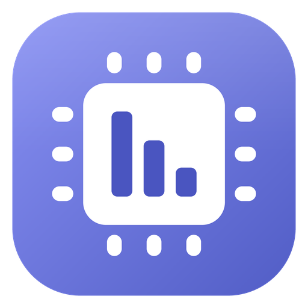

# GPU Reduct

Mem Reduct-style VRAM monitor & cleaner for Windows (C# / WPF / .NET 8), Linear-style dark UI.

## Requirements
- Windows 10 1709+ / Windows 11 with a WDDM 2.x GPU driver
- .NET 8 SDK to build: https://dotnet.microsoft.com/download/dotnet/8.0
- Admin rights (the app asks for elevation, like Mem Reduct)

## Build the .exe
- Easiest: double-click `build.bat`, the exe lands in `publish\GpuReduct.exe` (self-contained, runs without .NET installed)
- Manually, from an elevated terminal:

      dotnet run
      dotnet publish -c Release -r win-x64 --self-contained -p:PublishSingleFile=true -p:IncludeNativeLibrariesForSelfExtract=true -o publish

- Or open `GpuReduct.csproj` in Visual Studio 2022 / Rider (run the IDE as administrator)

## GitHub Actions (CI)
`.github/workflows/build.yml` builds `GpuReduct.exe` on every push to main/master and on pull requests.
- Download: repo > Actions > latest "Build" run > Artifacts > GpuReduct-win-x64
- Release: `git tag v0.2.0 && git push origin v0.2.0` attaches the exe to a GitHub Release
- Manual run: Actions > Build > Run workflow

## Features
- Live dedicated/shared VRAM, GPU load, 60s history, top VRAM consumers
- GPU picker in the title bar (hybrid laptops / multi-GPU)
- Tray icon shows live VRAM % (blue / orange >= 75% / red >= 90%); right-click > "Show VRAM % in tray icon" to switch to the logo
- Clean memory (Ctrl+Enter): trims the working sets of all processes using the GPU
- Reset driver: Win+Ctrl+Shift+B, restarts the graphics driver (the real VRAM flush)
- End process: hover a row in "Top consumers" and click the X
- Auto clean: runs Clean above a VRAM threshold (at most once a minute)
- Closing the window hides it to the tray; tray menu > Exit quits

## Known limitations
- Windows does not let one app force another to free dedicated VRAM; the driver's memory manager decides.
  Clean mostly frees RAM and shared GPU memory. Reset driver or closing apps frees real VRAM.
- On non-English Windows the GPU counter names may be translated. If the app says counters are
  unavailable, GpuMonitor needs to switch to PDH with PdhAddEnglishCounter.
